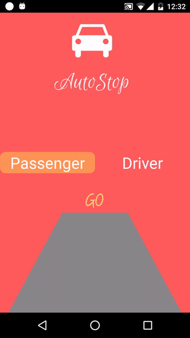
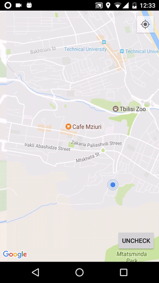

# Autostop

This application helps hitchhikers and autostopers find cars for traveling.They can see the cars on map and check if they are going in same direction.Then autostoper can choose right spot to stand.Also drivers can see the autostopers on map, and if they want it will be easy for them to share a ride with them.
# How to use
1.Choose which you are

2.Longpress on place you are going, to indicate your destination.

3.Tap on icon tu see it's destination

